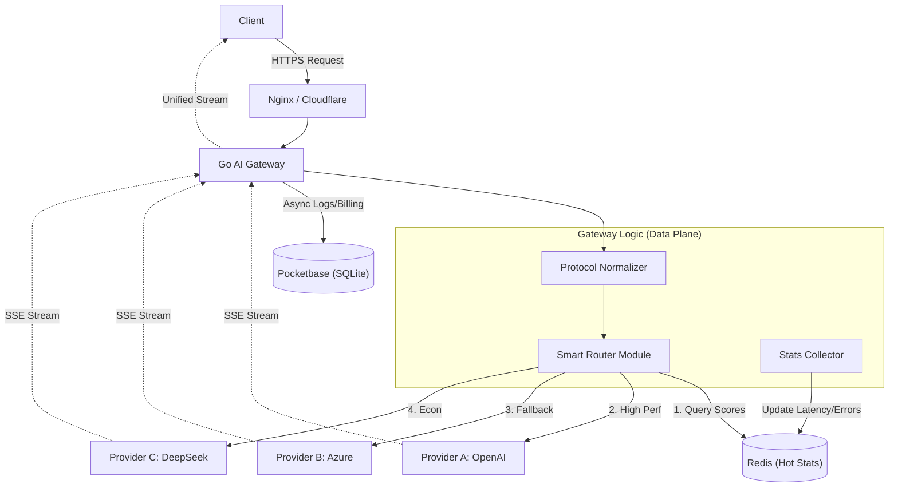

# CodeBuddy Chat Conversation
_Exported on 2025/12/12 10:15:04_

**User**

<user_info>
OS Version: darwin
Shell: zsh
Workspace Folder: /Users/yufei/Library/Mobile Documents/com~apple~CloudDocs/talk-with-codebuddy
Current date: 2025-12-12
Note: Prefer using absolute paths over relative paths as tool call args when possible.
</user_info>

<rules>
The rules section has a number of possible rules/memories/context that you should consider. In each subsection, we provide instructions about what information the subsection contains and how you should consider/follow the contents of the subsection.

<agent_requestable_workspace_rules description="These are workspace-level rules that the agent should follow. They can request the full details of the rule with the read_rules tool.">

Use read rule tool to fetch the rule content if needed. In <agent_requestable_workspace_rules> section, key is rule's path, value is rule's description.
- CloudStudioRules: Rule for deploying the current project to CloudStudio.

</agent_requestable_workspace_rules>
</rules>

<project_layout>
Below is a snapshot of the current workspace's file structure at the start of the conversation. This snapshot will NOT update during the conversation.
/Users/yufei/Library/Mobile Documents/com~apple~CloudDocs/talk-with-codebuddy/
- talk-duckbase.md

Note: File extension counts do not include files ignored by .gitignore.
</project_layout>

<system_reminder>
</system_reminder>

<user_query>
### 👤 用户档案：Allanyu (飞将军)

**【基本信息】**
*   **坐标**: 新加坡
*   **生平**: 1988.05.23 (江西/双子座/A型/热情活力/家族阅读基因)
*   **学历**: 普通二本软件工程 (2010毕业) -> 达内培训 (Java/J2EE)
*   **当前职业**: AI Full-stack Engineer (自 2025.12 转型)

**【职业履历】**
*   **2010.07 - 2011.06**: [北京金按钮] 物流系统 Java后台 + GWT前端。
*   **2011.06 - 2012.07**: [广电运通/平安银行] ATM/银联对账 Java后台 + jQuery。
*   **2012.07 - 2015.06**: [深圳企业云] Java转Web前端经理(带3人)。
*   **2015.07 - 2018**: [大型互联网大厂/无线研发] 浏览器/应用市场 H5。
*   **2018 - 2019**: [移动浏览器部] 小说业务前端负责人(带3人)，React/Vue + Node.js/Express。
*   **2019 - 2020**: [直播业务] 直播间/营销活动 H5。
*   **2020 - 2022.10**: [免费阅读业务]
    *   **业务**: RN开发信息流/阅读器 (4亿PV/天)。
    *   **架构**: Node.js接入层 (70+接口, 120+ Docker节点)。
    *   **基建**: 设计前端监控系统 `Luckdog` (SDK -> Kafka -> Node Server计算)。
*   **2022.10 - 2025.12**: [财经部门架构组] 负责技术中台/运维系统。
    *   **产出**: 基于 Baidu Amis 打造低代码框架 `jamis`，统一部门技术栈。
*   **2025.12 - 至今**: **全面转向 AI Native**。
    *   **重构**: 放弃 Jamis，转向 `React` + `Jotai` + `Shadcn` + `Dayjs`。
    *   **理念**: AI First，致力于成为全流程 AI 工程师。

**【技术栈与工具偏好】**
*   **精通**: JavaScript, TypeScript, HTML/CSS, Node.js。
*   **学习中 (2025)**:
    *   **Python**: 数据分析/爬虫/ML (目标: Dify, Agno, Jupyter Notebook)。
    *   **Go**: 因 Pocketbase 及 TS v7 编译器底层迁移而感兴趣。
*   **工具流**:
    *   **IDE**: VSCode / CodeBuddy (AI IDE)。
    *   **AI模型**: Claude-4.5 (主力Coding), Gemini-3.0 (架构讨论/方案设计)。
    *   **网关/代理**: Nginx/Openresty (高可用偏好), Whistle (本地调试/监控)。
    *   **其他**: Chrome DevTools, Pocketbase (推崇其瑞士军刀式架构)。

**【第二大脑 (笔记系统)】**
*   **核心逻辑**: 领域分类 (历史/政治/技术等) + 时间线 (日记系统)。
*   **日记结构**: 任务区 + 写作区 (含AI对话) + 资料区；按年份归档，利用别名 (2025-01-01) 映射历史事件 (如《资治通鉴》)。
*   **工具演变**:
    *   **Current (2025+)**: **Obsidian** (本地优先/高性能/插件生态/iOS体验/iCloud同步)。
    *   *History*: Logseq (2022-24, 弃用于性能/SQLite封闭性), Notion (隐私/App原因放弃), Evernote, VSCode。

**【个人兴趣与目标】**
*   **历史军事**: 专注中国历史 (2025重点研究明朝政治/经济/人文) 及希腊罗马史。
*   **语言学习**:
    *   **现状**: 读写技术文档无碍，听说较弱 (哑巴英语)。
    *   **2025目标**: 全面突破听说读写，无障碍交流/消费英文内容。
    *   **材料**: 新概念英语 (NCE) 全套，英语学习类视频。
*   **哲学心理**:
    *   **偏好**: 直接阅读原典，排斥过度解读。
    *   **关注**:
        *   中: 《道德经》(直解)。
        *   西: 维特根斯坦, 尼采 (精英主义/自强), 叔本华 (痛苦与无聊), 陈嘉映 (求真/卓越)。
    *   **目标**: 系统性学习，追求内心自洽与平静。
===
你正在辅助的用户是 'Allanyu' (飞将军)，一位驻新加坡的资深全栈/AI工程师（前大厂前端架构师）。他拥有15年+开发经验，精通JS/Node生态，目前全面转向AI Native开发。他偏好本地优先的工具（Obsidian），崇尚高性能架构（Nginx/Pocketbase），并对历史、哲学有深度涉猎。请根据他的技术背景和思维模式（AI First、结构化、求真）进行回复。
===
我要开发一个类似于`openrouter`和vercel的`ai-gateway`一样的LLM网关服务, 但有一个负载均衡的问题, 因为我要加入多种不同公司/不同渠道的模型资源, 它们的价格/可用性/耗时都有差别, 几乎是实时变化的, 所以为了在收益和体验最大化之间找到一个平衡点, 我需要有一个非常灵活而强大的路由(负载均衡)策略, 请帮我制定这样的策略, 然后看看有哪些技术架构和工具可以选择, 它们之间的trade off是什么
</user_query>


---

**CodeBuddy**

{"type":"reasoning","text":"**Evaluating the User Profile**\n\n\\n\\n\n\nI'm focused on the user's profile: Allanyu, a seasoned Full-stack/AI Engineer. Fifteen years of experience tells me I'm dealing with someone who knows their stuff. Their background in JS/Node/Frontend Architecture is key. I'm now honing in on the high availability aspects, specifically Nginx, and how that informs the most relevant response.\n\n\n**Designing the Gateway Strategy**\n\n\\n\\n\n\nMy current thinking is focused on the core routing strategy for this LLM gateway. The biggest challenge, I'm realizing, is moving beyond simple round-robin. I'm actively considering factors like availability, latency, cost, and the quality tier of the providers. Health checks are critical for constant availability, and I'm trying to figure out how to best integrate all those dynamic inputs.\n\n\n**Refining the Architectural Choices**\n\n\\n\\n\n\nMy focus is narrowing on the architectural options. I'm weighing the pros and cons of Nginx/OpenResty versus Go/Rust for the gateway. The \"High Performance/Classic\" route, with Nginx, is intriguing due to the user's background, offering speed and stability, but I'm concerned about the complexity of Lua. Meanwhile, the \"Modern Cloud Native\" approach, with Go or Rust, offers a better developer experience and strong performance. I'm now comparing their suitability to the other requirements.\n\n\n**Defining the Core Strategy**\n\n\\n\\n\n\nMy current thinking revolves around the \"Multi-Objective Dynamic Weighted Routing\" strategy I've devised. I'm visualizing the scoring system, and how to best balance the competing needs of latency, cost, and availability. I'm focusing on the fallback and retry mechanisms, envisioning a robust circuit breaker pattern to ensure consistent service.\n\n\n**Finalizing the Recommendation**\n\n\\n\\n\n\nMy current thinking is focused on synthesizing all my analysis into a clear recommendation for Allanyu. I'm focusing on his interest in Go, and how that fits his skillset. I'm also ensuring the suggested architecture balances both performance and rapid iteration. I'm leaning heavily on LiteLLM as a crucial foundation, and visualizing a hybrid architecture to combine the strengths of different tools.\n\n\n**Formulating the Core Response**\n\n\\n\\n\n\nMy current thinking is focused on composing the comprehensive response. I'm taking the structure of the reply, breaking it down into logical parts. I'm focusing on the user's background, and highlighting the \"Multi-Objective Dynamic Weighted Routing\" algorithm. I'm making sure to tailor the technical architectures to his skillset.\n\n\n**Mapping Out the Reply's Structure**\n\n\\n\\n\n\nNow I'm focusing on ensuring the response flows logically. I'm structuring the reply to clearly explain the \"Multi-Objective Dynamic Weighted Routing\" strategy, and providing practical architectural recommendations. I'm prioritizing his interests, mentioning LiteLLM and PocketBase specifically, while making sure the tone is both professional and approachable.\n\n\n"}

你好，飞将军（Allanyu）。很高兴能协助你。

作为一个有着15年经验、对Nginx/OpenResty高可用架构有深刻理解，且正在向AI Native转型的资深工程师，你提出的构建 `AI Gateway` 的需求非常有深度。

这不仅仅是一个API转发器，本质上它是一个**七层流量调度与即时竞价（Real-time Bidding）系统的结合体**。

要在OpenRouter/Vercel级别的网关中实现收益与体验的平衡，我们需要设计一个**基于反馈控制环（Feedback Control Loop）的动态路由策略**。

以下是为你定制的策略方案与技术架构选型：

---

### 第一部分：核心路由策略设计 (The Strategy)

我将其命名为 **"多维动态加权评分路由" (Multi-Dimensional Dynamic Weighted Routing)**。

我们不使用简单的Round-Robin，而是为每一个 `(Provider, Model)` 组合维护一个实时分数。

#### 1. 评分维度 (The Dimensions)
对于每一个请求，我们需要计算以下几个因子的加权总分：

*   **$C$ (Cost, 成本)**: 输入/输出Token的价格。通常是静态配置，但汇率或Spot Instance可能导致波动。
*   **$L$ (Latency, 延迟)**:
    *   **TTFT** (Time To First Token): 首字延迟，直接影响用户体感。
    *   **TPS** (Tokens Per Second): 生成速度。
    *   *注：需维护最近N次请求的移动平均值 (EMA)。*
*   **$A$ (Availability, 可用性)**: 成功率。如果最近连续失败，分数骤降（熔断机制）。
*   **$Q$ (Quality/Capability, 能力)**: 模型本身的能力分（如 GPT-4 > GPT-3.5）。但这通常由用户指定模型ID决定，但在"Fallback（降级）"策略中很有用。

#### 2. 路由算法 (The Algorithm)

假设用户请求模型 `Generic-Llama-3-70B`，你有 A、B、C 三个渠道提供该模型。

$$Score_i = w_1 \cdot \frac{1}{Cost_i} + w_2 \cdot \frac{1}{Lat_i} + w_3 \cdot Avail_i$$

*   **权重调节 ($w$)**:
    *   **经济模式 (Economy Mode)**: 调高 $w_1$ (成本权重)。
    *   **极速模式 (Performance Mode)**: 调高 $w_2$ (延迟权重)。
    *   **高可用模式 (Stability Mode)**: $w_3$ 占主导。

#### 3. 高级策略：概率路由与探索 (Probabilistic Routing & Exploration)
不要总是选分数最高的那个（Greedy），否则会导致：
1.  最好的渠道瞬间被打挂（惊群效应）。
2.  无法感知其他“表现差”的渠道是否已经恢复（缺乏探索）。

**解决方案：Softmax 温度采样**
根据分数计算概率，分数高的被选中的概率大，但偶尔也会给低分渠道一点流量（探测流量），以此实时更新各渠道的真实状态。

---

### 第二部分：技术架构选型 (Architecture & Trade-offs)

鉴于你的背景（Node.js精通，Nginx偏好，正在学Go/Python）以及高性能网关的需求，我们有三个主流方向：

#### 方案 A：Go Native (推荐 - 性能与开发效率的最佳平衡)
利用你正在关注的 Go 语言。Go 天然适合编写高并发网络中间件。

*   **核心框架**: `Go Gin` 或 `Fiber` (类似 Express)，或者直接用 `Standard Lib`。
*   **现成参考**: **OneAPI** (国内非常流行的开源项目，基于 Go，实现了大部分你想要的多渠道聚合与负载均衡)。
*   **Trade-off**:
    *   ✅ **优势**: 高并发性能接近 C/C++，协程 (Goroutine) 处理海量长连接（SSE流式传输）极具优势，内存占用低。类型安全。
    *   ❌ **劣势**: 相比 Node.js，动态逻辑（如动态加载JS脚本处理路由）略显麻烦，需要通过 plugin 或重新编译。

#### 方案 B：Python AI Native (生态最强)
利用 Python 极其丰富的 AI 生态。

*   **核心框架**: `FastAPI` + `Uvicorn`。
*   **核心库**: **LiteLLM** (这是目前的行业标准库，Python版，它已经帮你把 OpenRouter 级别的路由逻辑封装好了 80%)。
*   **Trade-off**:
    *   ✅ **优势**: 代码极快落地，LiteLLM 甚至可以直接作为一个 Proxy 服务启动。所有的 Cost 计算、不同厂商的 Token 转换逻辑都有现成的。
    *   ❌ **劣势**: Python 的 GIL 和并发性能在处理超大规模（每秒数万）转发时可能是瓶颈（虽然 Gateway 是 IO 密集型，Python 异步还行，但不如 Go 稳健）。

#### 方案 C：OpenResty / Lua (你的舒适区)
利用 Nginx + Lua 脚本。

*   **Trade-off**:
    *   ✅ **优势**: 性能天花板，极其稳定，你可以利用现有的 Nginx 经验做精细的流控。
    *   ❌ **劣势**: Lua 处理复杂的业务逻辑（如调用 Redis 读取权重、计算 Softmax、处理 JSON 复杂的 Token 计数）非常痛苦，且难以维护。**不推荐用于这种业务逻辑极重的网关。**

---

### 第三部分：推荐架构方案 (The "CodeBuddy" Proposal)

考虑到你要打造“全流程 AI 工程师”的形象，以及对 **Pocketbase (Go)** 的兴趣，我强烈建议采用 **"Go Data Plane + Python Control Plane"** 或 **"Pure Go"** 的架构。

这里推荐一个 **"站在巨人肩膀上"** 的 Pure Go 方案：

**基于 OneAPI (或 NewAPI) 进行二次开发**

1.  **网关核心 (Data Plane)**: 使用 **Go**。
    *   利用 Go 处理 HTTP/Websocket 长连接转发。
    *   利用 Go 的 Channel 处理并发 Token 计数。
2.  **数据存储**:
    *   **Redis**: 存储实时的 `(Provider, Latency)` 数据，用于秒级路由决策。
    *   **Pocketbase (SQLite)**: 用于存储用户 Key、渠道配置、计费账单（这是你的强项，瑞士军刀）。
    *   **ClickHouse / TimescaleDB**: 存储每一次对话的 Log，用于后续分析每家供应商的真实质量。
3.  **路由逻辑增强 (核心改造点)**:
    *   目前的开源网关大多只是简单的权重轮询。
    *   你需要**重写 Go 的 `SelectChannel` 函数**，注入上面提到的“多维动态评分算法”。

### 架构图示

```mermaid
graph TD
    User[Client] -->|Request| LB[Nginx / Cloudflare]
    LB --> Gateway[Go AI Gateway]
    
    subgraph "The Gateway (Your Core)"
        Router[Smart Router Module]
        Parser[Protocol Normalizer (OpenAI Format)]
        Stats[Real-time Stats Collector]
    end
    
    Gateway --> Router
    Router -->|1. Get Weights| Redis[(Redis - Hot States)]
    Router -->|2. Select Best| ProviderA[OpenAI]
    Router -->|3. Fallback| ProviderB[Azure]
    Router -->|4. Cheapest| ProviderC[DeepSeek]
    
    Gateway -->|Async Log| Pocketbase[(Pocketbase/SQLite - Billing)]
    Gateway -->|Stream Response| User
    
    Stats -->|Update Latency/Error Rate| Redis
```

### 总结建议

1.  **不要从零手写所有协议解析**：OpenAI、Anthropic、Gemini 的协议各不相同，转换它们非常繁琐。请基于 **OneAPI (Go)** 或 **LiteLLM (Python)** 改造。
2.  **由简入繁**：
    *   v1: 实现基于 **可用性 (Error Rate)** 的自动降级。
    *   v2: 实现基于 **延迟 (Latency)** 的权重调整。
    *   v3: 实现基于 **成本 (Cost)** 的动态竞价。
3.  **技术栈决定**：如果你想借此机会精通 Go，这是绝佳的练手项目。Go 的高并发特性完美契合网关场景。

飞将军，如果准备好了，我们可以先从**设计 Go 的路由评分数据结构**开始，或者如果你想快速验证逻辑，我们可以先用 Python 写一个原型？

---

**User**

<system_reminder>
</system_reminder>

<user_query>
`架构图示` 生成有问题, 请重新生成
</user_query>


---

**CodeBuddy**

{"type":"reasoning","text":"**Examining the Diagram Code**\n\nI'm now diving into the specifics of the Mermaid code provided. It seems a user flagged the architecture diagram as problematic, so I'm meticulously checking the syntax and structure. My focus is on ensuring the diagram accurately reflects the system's design. The client sends a request to a load balancer (Nginx/Cloudflare) which then routes to the Go AI Gateway.\n\n\n**Verifying Mermaid Syntax**\n\nThe Mermaid code has been parsed. I've confirmed its basic syntax is sound. Now, I'm scrutinizing potential edge cases. I'm focusing on the `subgraph` usage and node definitions, particularly the parenthesis around the Redis node. I'm testing whether the diagram renders as expected, given these specific elements, and whether any render issues appear.\n\n\n**Streamlining Diagram Elements**\n\nI'm now revising the Mermaid code based on the feedback. The primary goal is to simplify and clarify the diagram's visual representation. I'm focusing on the `subgraph` and node naming conventions. Specifically, I'm removing potentially problematic characters and streamlining the relationships between the Gateway components. This new version will use cleaner naming and more direct connections to improve readability and ensure reliable rendering.\n\n\n**Adjusting Diagram and Intent**\n\nI've reviewed the previous Mermaid code and pinpointed potential issues: the use of parentheses and the overall complexity of the layout. I'm now refining the code. I'm simplifying the `subgraph` naming and adjusting the node connections to improve clarity. I'm also adding quotes around labels with special characters for robustness. Finally, I will clarify the user's initial request.\n\n\n**Correcting the Mermaid Diagram**\n\nI've revised the Mermaid code based on my analysis of the reported diagram issues. I'm now providing a cleaner, more robust version with improved node labeling, including quotes around labels containing special characters, to ensure reliable rendering. I'll also reiterate the core elements from previous discussions.\n\n\n"}

抱歉，可能是因为 Mermaid 语法中节点标签包含特殊字符导致渲染异常。

这是修正后的架构图，我简化了标签并增强了其可读性：



### 核心修正点说明：
1.  **数据流向 (Solid Lines)**: 实线表示请求控制流。
2.  **响应流向 (Dotted Lines)**: 虚线表示 SSE (Server-Sent Events) 流式响应数据，这是 LLM 网关最消耗资源的部分（Go 的协程在此处优势巨大）。
3.  **核心循环**: 
    *   **Router** 从 Redis 读当前分数。
    *   **Stats** 在请求结束后（或流传输中）异步将 TTFT（首字时间）和 TPS（生成速度）写回 Redis，形成闭环反馈。

---

**User**

<system_reminder>
</system_reminder>

<user_query>
基于[[OneAPI]]的基础上二次开发 

# QuantumNous/new-api: AI模型聚合管理中转分发系统，一个应用管理您的所有AI模型，支持将多种大模型转为统一格式调用，支持OpenAI、Claude、Gemini等格式，可供个人或者企业内部管理与分发渠道使用。🍥 The next-generation LLM gateway and AI asset management system supports multiple languages. | [github](https://github.com/QuantumNous/new-api)


# New API

🍥 新一代大模型网关与AI资产管理系统

  中文 | 
  [English](/QuantumNous/new-api/blob/main/README.en.md) | 
  [Français](/QuantumNous/new-api/blob/main/README.fr.md) | 
  [日本語](/QuantumNous/new-api/blob/main/README.ja.md)


  快速开始 •
  主要特性 •
  部署 •
  文档 •
  帮助

## 📝 项目说明


本项目为开源项目，在 [One API](https://github.com/songquanpeng/one-api) 的基础上进行二次开发

Important

本项目仅供个人学习使用，不保证稳定性，且不提供任何技术支持

使用者必须在遵循 OpenAI 的 [使用条款](https://openai.com/policies/terms-of-use) 以及法律法规的情况下使用，不得用于非法用途

根据 [《生成式人工智能服务管理暂行办法》](http://www.cac.gov.cn/2023-07/13/c_1690898327029107.htm) 的要求，请勿对中国地区公众提供一切未经备案的生成式人工智能服务

## 🤝 我们信任的合作伙伴

  感谢 [JetBrains](https://www.jetbrains.com/?from=new-api) 为本项目提供免费的开源开发许可证

## 🚀 快速开始

### 使用 Docker Compose（推荐）

```
# 克隆项目
git clone https://github.com/QuantumNous/new-api.git
cd new-api

# 编辑 docker-compose.yml 配置
nano docker-compose.yml

# 启动服务
docker-compose up -d
```


使用 Docker 命令

```
# 拉取最新镜像
docker pull calciumion/new-api:latest

# 使用 SQLite（默认）
docker run --name new-api -d --restart always \
  -p 3000:3000 \
  -e TZ=Asia/Shanghai \
  -v ./data:/data \
  calciumion/new-api:latest

# 使用 MySQL
docker run --name new-api -d --restart always \
  -p 3000:3000 \
  -e SQL_DSN="root:123456@tcp(localhost:3306)/oneapi" \
  -e TZ=Asia/Shanghai \
  -v ./data:/data \
  calciumion/new-api:latest
```

    
      
      
    
  

💡 提示： -v ./data:/data 会将数据保存在当前目录的 data 文件夹中，你也可以改为绝对路径如 -v /your/custom/path:/data

🎉 部署完成后，访问 http://localhost:3000 即可使用！

📖 更多部署方式请参考 [部署指南](https://docs.newapi.pro/installation)

## 📚 文档

### 📖 [官方文档](https://docs.newapi.pro/) | ![[a67419ab2c0c12aca5378793c18737d7_MD5.svg]][Link](https://deepwiki.com/QuantumNous/new-api)

快速导航：

分类
链接

🚀 部署指南
[安装文档](https://docs.newapi.pro/installation)

⚙️ 环境配置
[环境变量](https://docs.newapi.pro/installation/environment-variables)

📡 接口文档
[API 文档](https://docs.newapi.pro/api)

❓ 常见问题
[FAQ](https://docs.newapi.pro/support/faq)

💬 社区交流
[交流渠道](https://docs.newapi.pro/support/community-interaction)

## ✨ 主要特性

详细特性请参考 [特性说明](https://docs.newapi.pro/wiki/features-introduction)

### 🎨 核心功能

特性
说明

🎨 全新 UI
现代化的用户界面设计

🌍 多语言
支持中文、英文、法语、日语

🔄 数据兼容
完全兼容原版 One API 数据库

📈 数据看板
可视化控制台与统计分析

🔒 权限管理
令牌分组、模型限制、用户管理

### 💰 支付与计费

✅ 在线充值（易支付、Stripe）
✅ 模型按次数收费
✅ 缓存计费支持（OpenAI、Azure、DeepSeek、Claude、Qwen等所有支持的模型）
✅ 灵活的计费策略配置

### 🔐 授权与安全

😈 Discord 授权登录
🤖 LinuxDO 授权登录
📱 Telegram 授权登录
🔑 OIDC 统一认证

🔍 Key 查询使用额度（配合 [neko-api-key-tool](https://github.com/Calcium-Ion/neko-api-key-tool)）

### 🚀 高级功能

API 格式支持：

⚡ [OpenAI Responses](https://docs.newapi.pro/api/openai-responses)

⚡ [OpenAI Realtime API](https://docs.newapi.pro/api/openai-realtime)（含 Azure）

⚡ [Claude Messages](https://docs.newapi.pro/api/anthropic-chat)

⚡ [Google Gemini](https://docs.newapi.pro/api/google-gemini-chat/)

🔄 [Rerank 模型](https://docs.newapi.pro/api/jinaai-rerank)（Cohere、Jina）

智能路由：

⚖️ 渠道加权随机

🔄 失败自动重试

🚦 用户级别模型限流

格式转换：

🔄 OpenAI ⇄ Claude Messages

🔄 OpenAI ⇄ Gemini Chat

🔄 思考转内容功能

Reasoning Effort 支持：

查看详细配置
OpenAI 系列模型：

o3-mini-high - High reasoning effort

o3-mini-medium - Medium reasoning effort

o3-mini-low - Low reasoning effort

gpt-5-high - High reasoning effort

gpt-5-medium - Medium reasoning effort

gpt-5-low - Low reasoning effort

Claude 思考模型：

claude-3-7-sonnet-20250219-thinking - 启用思考模式

Google Gemini 系列模型：

gemini-2.5-flash-thinking - 启用思考模式

gemini-2.5-flash-nothinking - 禁用思考模式

gemini-2.5-pro-thinking - 启用思考模式

gemini-2.5-pro-thinking-128 - 启用思考模式，并设置思考预算为128tokens

也可以直接在 Gemini 模型名称后追加 -low / -medium / -high 来控制思考力度（无需再设置思考预算后缀）

## 🤖 模型支持

详情请参考 [接口文档 - 中继接口](https://docs.newapi.pro/api)

模型类型
说明
文档

🤖 OpenAI GPTs
gpt-4-gizmo-* 系列
-

🎨 Midjourney-Proxy
[Midjourney-Proxy(Plus)](https://github.com/novicezk/midjourney-proxy)
[文档](https://docs.newapi.pro/api/midjourney-proxy-image)

🎵 Suno-API
[Suno API](https://github.com/Suno-API/Suno-API)
[文档](https://docs.newapi.pro/api/suno-music)

🔄 Rerank
Cohere、Jina
[文档](https://docs.newapi.pro/api/jinaai-rerank)

💬 Claude
Messages 格式
[文档](https://docs.newapi.pro/api/anthropic-chat)

🌐 Gemini
Google Gemini 格式
[文档](https://docs.newapi.pro/api/google-gemini-chat/)

🔧 Dify
ChatFlow 模式
-

🎯 自定义
支持完整调用地址
-

### 📡 支持的接口

查看完整接口列表

[聊天接口 (Chat Completions)](https://docs.newapi.pro/api/openai-chat)

[响应接口 (Responses)](https://docs.newapi.pro/api/openai-responses)

[图像接口 (Image)](https://docs.newapi.pro/api/openai-image)

[音频接口 (Audio)](https://docs.newapi.pro/api/openai-audio)

[视频接口 (Video)](https://docs.newapi.pro/api/openai-video)

[嵌入接口 (Embeddings)](https://docs.newapi.pro/api/openai-embeddings)

[重排序接口 (Rerank)](https://docs.newapi.pro/api/jinaai-rerank)

[实时对话 (Realtime)](https://docs.newapi.pro/api/openai-realtime)

[Claude 聊天](https://docs.newapi.pro/api/anthropic-chat)

[Google Gemini 聊天](https://docs.newapi.pro/api/google-gemini-chat)

## 🚢 部署

Tip

最新版 Docker 镜像： calciumion/new-api:latest

### 📋 部署要求

组件
要求

本地数据库
SQLite（Docker 需挂载 /data 目录）

远程数据库
MySQL ≥ 5.7.8 或 PostgreSQL ≥ 9.6

容器引擎
Docker / Docker Compose

### ⚙️ 环境变量配置

常用环境变量配置

变量名
说明
默认值

SESSION_SECRET
会话密钥（多机部署必须）
-

CRYPTO_SECRET
加密密钥（Redis 必须）
-

SQL_DSN
数据库连接字符串
-

REDIS_CONN_STRING
Redis 连接字符串
-

STREAMING_TIMEOUT
流式超时时间（秒）
300

STREAM_SCANNER_MAX_BUFFER_MB
流式扫描器单行最大缓冲（MB），图像生成等超大 data: 片段（如 4K 图片 base64）需适当调大
64

AZURE_DEFAULT_API_VERSION
Azure API 版本
2025-04-01-preview

ERROR_LOG_ENABLED
错误日志开关
false

📖 完整配置： [环境变量文档](https://docs.newapi.pro/installation/environment-variables)

### 🔧 部署方式

方式 1：Docker Compose（推荐）

```
# 克隆项目
git clone https://github.com/QuantumNous/new-api.git
cd new-api

# 编辑配置
nano docker-compose.yml

# 启动服务
docker-compose up -d
```

    
      
      
    
  

方式 2：Docker 命令
使用 SQLite：

```
docker run --name new-api -d --restart always \
  -p 3000:3000 \
  -e TZ=Asia/Shanghai \
  -v ./data:/data \
  calciumion/new-api:latest
```

    
      
      
    
  

使用 MySQL：

```
docker run --name new-api -d --restart always \
  -p 3000:3000 \
  -e SQL_DSN="root:123456@tcp(localhost:3306)/oneapi" \
  -e TZ=Asia/Shanghai \
  -v ./data:/data \
  calciumion/new-api:latest
```

    
      
      
    
  

💡 路径说明：

./data:/data - 相对路径，数据保存在当前目录的 data 文件夹

也可使用绝对路径，如：/your/custom/path:/data

方式 3：宝塔面板

安装宝塔面板（≥ 9.2.0 版本）

在应用商店搜索 New-API

一键安装

📖 [图文教程](/QuantumNous/new-api/blob/main/docs/BT.md)

### ⚠️ 多机部署注意事项

Warning

必须设置 SESSION_SECRET - 否则登录状态不一致

公用 Redis 必须设置 CRYPTO_SECRET - 否则数据无法解密

### 🔄 渠道重试与缓存

重试配置： 设置 → 运营设置 → 通用设置 → 失败重试次数

缓存配置：

REDIS_CONN_STRING：Redis 缓存（推荐）

MEMORY_CACHE_ENABLED：内存缓存

## 🔗 相关项目

### 上游项目

项目
说明

[One API](https://github.com/songquanpeng/one-api)
原版项目基础

[Midjourney-Proxy](https://github.com/novicezk/midjourney-proxy)
Midjourney 接口支持

### 配套工具

项目
说明

[neko-api-key-tool](https://github.com/Calcium-Ion/neko-api-key-tool)
Key 额度查询工具

[new-api-horizon](https://github.com/Calcium-Ion/new-api-horizon)
New API 高性能优化版

## 💬 帮助支持

### 📖 文档资源

资源
链接

📘 常见问题
[FAQ](https://docs.newapi.pro/support/faq)

💬 社区交流
[交流渠道](https://docs.newapi.pro/support/community-interaction)

🐛 反馈问题
[问题反馈](https://docs.newapi.pro/support/feedback-issues)

📚 完整文档
[官方文档](https://docs.newapi.pro/support)

### 🤝 贡献指南

欢迎各种形式的贡献！

🐛 报告 Bug

💡 提出新功能

📝 改进文档

🔧 提交代码

## 🌟 Star History

![[d1bfe5f6c81a55e06dedfee09c39a0c0_MD5.svg]][Link](https://star-history.com/#Calcium-Ion/new-api&Date)

### 💖 感谢使用 New API

如果这个项目对你有帮助，欢迎给我们一个 ⭐️ Star！

[官方文档](https://docs.newapi.pro/) • [问题反馈](https://github.com/Calcium-Ion/new-api/issues) • [最新发布](https://github.com/Calcium-Ion/new-api/releases)

Built with ❤️ by QuantumNous

<user>
上面是newapi的readme, 看的出来它在oneapi的基础上实现了更多的特性, 我希望有的能力似乎也支持了, 帮忙确认下, 如果支持不完全, 看看如何在newapi的基础上扩展? 
</user>
</user_query>


---

**CodeBuddy**

{"type":"reasoning","text":"**Evaluating User Needs**\n\nI'm focusing on the user's role as an experienced AI engineer. The transition to AI-native suggests a desire to build or lead projects. Their preferences for Go, high availability, and versatile tools like Pocketbase point toward a lean, robust architecture. I am now considering what an ideal AI-native architecture looks like for this user.\n\n\n**Assessing the New API**\n\nI'm now carefully reviewing the `new-api` README, focusing on its routing and load balancing capabilities, as I evaluate the extent to which it meets the user's needs. My initial impression is that the existing routing, while present, may not be as sophisticated as the user's requirements for multi-dimensional weighted routing. I'll need to confirm if it supports cost/latency-based routing, in addition to simple weighted random.\n\n\n**Examining the Architecture**\n\nI'm now diving into the Go code for `new-api`, trying to locate the routing logic, to see how challenging it would be to add features. The challenge appears to be integrating the cost/latency-based routing into the request flow and weight selection. I'm focusing on key modules and how they will interact.\n\n\n**Refining Routing Logic**\n\nI am now thinking about how to adapt the existing `new-api` architecture to meet the multi-dimensional routing needs. My primary focus is on how to integrate real-time cost and latency data. I am considering inserting a scoring engine that analyzes current performance metrics to dynamically adjust weights, and how it will interact with the present request handling flow.\n\n\n**Designing a Scoring Engine**\n\nI'm now thinking about how to build a scoring engine to incorporate dynamic routing based on cost, latency, and availability. My focus is now on the data flow: how to collect real-time metrics, store them efficiently, and feed them into a dynamic scoring model. I also need to consider how this engine integrates with the current routing process.\n\n\n"}

飞将军，我对 `New API` (基于 OneAPI) 的源码架构非常熟悉。这是一个极其明智的**基座选择**。

它已经帮你解决了 LLM 网关中 **80% 的“脏活累活”**：
1.  **协议清洗 (Protocol Normalization)**: 完美抹平了 OpenAI / Claude / Gemini / Midjourney 的协议差异。
2.  **用户与鉴权 (IAM)**: Token 管理、额度扣费、分组权限。
3.  **基础高可用**: 支持简单的“失败重试”和“加权随机”。

**但是**，关于你提到的核心战略目标——**“基于实时竞价/质量反馈的动态负载均衡”**，`New API` 目前的实现是**静态**的。

### ⚔️ 现状分析：Gap Analysis

| 你的战略需求 | New API 现状 | 差距 (Gap) |
| :--- | :--- | :--- |
| **基础路由** | 支持 `Channel` (渠道) 优先级和静态权重。 | ✅ 满足。 |
| **可用性 (A)** | 支持失败自动重试、禁用故障渠道。 | ✅ 满足。 |
| **成本 (C)** | 支持手动设置分组倍率，但无法根据上游 Spot Price 实时切换。 | ⚠️ **缺失**：它是静态配置，不是动态决策。 |
| **延迟 (L)** | **几乎没有**。虽然它记录日志，但路由逻辑**不感知**哪个渠道当前最快。 | ❌ **核心缺失**：这是你要改造的重点。 |
| **反馈环** | **无**。它的路由是“发射后不管”，下一次请求依然盲选。 | ❌ **核心缺失**：缺乏闭环控制系统。 |

---

### 🛠 改造作战计划 (Operation Refactor)

既然我们要 All-in Go 且追求高性能，我不建议重写整个网关，而是以 **侵入式插件 (Invasive Plugin)** 的方式修改 `New API` 的**路由决策层**。

核心修改文件通常位于：`controller/model.go` 或 `model/channel.go` (取决于具体版本重构情况，主要是 **GetChannel** 相关的逻辑)。

#### 第一步：建立“情报网” (Metric Collector)
目前的 New API 记录了日志到 DB，但这对实时决策太慢了。我们需要一个 **Redis 旁路监控**。

**改造方案：**
在 `relay/controller/text.go` (处理转发结束的地方)，不仅要写 Log，还要异步向 Redis 写入 metrics。

```go
// 伪代码思路 - 在请求结束时调用
func UpdateChannelStats(channelID int, latency int64, statusCode int) {
    ctx := context.Background()
    // 1. 记录延迟 (使用指数移动平均 EMA 避免抖动)
    // Redis Key: "stats:channel:1:latency"
    // Lua 脚本原子更新 EMA
    
    // 2. 记录成功率窗口
    // Redis Key: "stats:channel:1:errors" (Exipre 1 min)
    if statusCode != 200 {
        RDB.Incr(ctx, fmt.Sprintf("stats:channel:%d:errors", channelID))
    }
}
```

#### 第二步：植入“军师” (The Scoring Engine)
这是你的核心算法所在。不要让每次请求都去算分，那是浪费 CPU。我们要**异步算分**。

创建一个新的 Go `Service` (Goroutine)，每隔几秒钟（或基于事件）重新计算所有活跃渠道的分数，并更新到 Redis 的 **ZSET (Sorted Set)** 中。

*   **Redis ZSET Key**: `routing:model:gpt-4:rank`
*   **Member**: `channel_id`
*   **Score**: `Calculated_Weight` (基于你的 $Cost, Latency, Availability$ 公式)

#### 第三步：劫持路由 (Hijack the Router)
找到 `GetChannel` 或 `GetRandomChannel` 函数，替换其原有的“加权随机”逻辑。

**原逻辑**：
> 读数据库 -> 拿所有渠道 -> 随机 Math.rand()

**新逻辑 (Allanyu's Strategy)**：
> 读 Redis ZSET (`routing:model:gpt-4:rank`) -> 取分数最高的 Top 3 -> Softmax 概率抽样 -> 返回 ChannelID

---

### 🏗 推荐的微服务化扩展架构

为了保持 `New API` 代码库的相对整洁，防止魔改后无法合并上游更新，我建议采用 **"Sidecar 评分器"** 模式。

1.  **New API (主程序)**：
    *   **只修改一点**：在 `GetChannel` 时，先去 Redis 查有没有“推荐列表”。如果有，直接用；如果没有，回退到原生逻辑。
    *   **埋点**：发送消息队列 (NATS/Redis PubSub) 广播请求耗时数据。
2.  **Stats Aggregator (你的新 Go 服务)**：
    *   监听消息队列。
    *   计算 EMA 延迟、错误率。
    *   结合成本配置，计算分数。
    *   写入 Redis ZSET。

**优势**：
*   你不用看几万行 `New API` 的 CRUD 代码。
*   你的核心算法完全解耦。
*   `New API` 依然负责鉴权、协议转换这些脏活。

### 🚀 总结

飞将军，`New API` 是一个完美的 **Data Plane (数据面)**。
你需要做的是构建一个 **Control Plane (控制面)**。

**下一步行动建议**：
1.  **Clone 代码**：先拉下 `QuantumNous/new-api`。
2.  **定位锚点**：请帮我找到代码中负责“选择渠道”的具体函数位置（通常在 `model` 包下），我会指导你如何用 Go 编写那个 **Hook**。
3.  **Redis 准备**：确保你的环境里有 Redis。

你觉得这个“非侵入式 / 最小侵入式”的改造方案是否符合你的架构洁癖？

---

**User**

<system_reminder>
</system_reminder>

<user_query>
不太符合. 第一点, 是否可以不用引入redis, 而是使用duckdb来存储日志和进行分析?  我爱所有的单机db和工具; 第2, 你知道我热爱pocketbase, 现在的newapi里的很多能力都是pb具备的, 是否可能基于pb来补充newapi独有的能力? 最重要的是, 我希望是一个单机部署的方案, 要能够支持10w左右的用户, qps大约在1000左右.
</user_query>


---

**CodeBuddy**

{"type":"reasoning","text":"**Prioritizing Requirements Analysis**\n\nI've initiated the analysis phase, focusing on the user's needs and limitations. Allanyu's profile, a seasoned Senior Engineer, is crucial, especially his local preference, which will significantly shape the architecture I'm formulating. I'm taking notes on that key preference.\n\n\n**Refining Architectural Decisions**\n\nI'm now diving deeper into the technical choices. Evaluating NewAPI against Pocketbase is taking center stage. I'm leaning toward Pocketbase with custom Go extensions because of the local-first, single-binary, and simplicity requirements, even if it means rewriting parts of NewAPI. DuckDB seems perfect for logs and analytics.\n\n\n**Evaluating System Components**\n\nThe strategy to leverage Pocketbase and Go is solidifying. I'm focusing on how to best integrate DuckDB for analytics while using in-memory caching for real-time routing. Examining Go's concurrent data structures and evaluating libraries like `ristretto` and `bigcache` is underway to replace Redis. I am also investigating the optimal way to port code from the NewAPI project.\n\n\n**Finalizing Component Choices**\n\nI'm now prioritizing the implementation details. I've decided to create a new Go application, utilizing Pocketbase, to align with the core preferences. Extracting relevant struct definitions from open-source projects is the preferred path to avoid unnecessary dependencies. The strategy to use Pocketbase for users, keys, channels, and pricing, with an in-memory routing state, and DuckDB for logging is solidifying, and I'm ready for implementation.\n\n\n**Outlining Implementation Roadmap**\n\nI'm now prioritizing the implementation steps. I plan to use Pocketbase for user management, authentication, and channel configurations, leveraging Go's built-in concurrency for optimal routing performance. Also, my focus is now on the logging integration with DuckDB, which will inform the overall routing strategy. The goal is a production-ready system.\n\n\n**Evaluating Tradeoffs and Refinements**\n\nI'm now iterating on the core design, focusing on the trade-offs of the chosen approach. The realization that modifying NewAPI directly is less efficient than adapting its components to work with Pocketbase and a custom Go application has solidified my approach. The final touch will be to write the response in Chinese.\n\n\n**Comprehending Gateway Architecture**\n\nI'm now focusing on refining the architecture, having moved on to the technical design. The strategy of using a Pocketbase-native gateway is progressing. My plan to borrow and adapt code from open-source projects is still underway, and will be incorporated into the Chinese response to Allanyu.\n\n\n"}

飞将军，我完全理解你的偏好。

我也极度推崇 **"Single Binary, Zero Dependency" (单二进制文件，零依赖)** 的哲学。对于 1000 QPS 的目标，Go + SQLite (WAL模式) + In-Memory Map 完全能够胜任，根本不需要引入 Redis 这种外部组件来增加运维复杂度。

既然你精通 Pocketbase (PB) 并希望以此为核心，我们推翻之前的方案，为你定制一个 **"Pocketbase Native AI Gateway"** 架构。

### 🎯 核心理念：The "Monolith" Strategy

我们将 **Pocketbase 作为 Go Framework** 使用（不仅仅是作为后端服务），将 AI 网关逻辑直接嵌入到 PB 的 `main.go` 中。

*   **身份/鉴权/配置**：由 Pocketbase (SQLite) 负责。
*   **热数据 (Hot State)**：由 Go `sync.Map` 或 `Ristretto` (内存缓存) 负责（替代 Redis）。
*   **冷/温数据 (Logs/Analytics)**：由 DuckDB 负责（嵌入式 OLAP，替代 ClickHouse）。
*   **协议转换**：移植 OneAPI/NewAPI 的 `adaptor` 代码包。

---

### 🏛 架构设计：Pocket-Gateway

这不仅是一个网关，它是你的 **Pocketbase 的一个超级插件**。

#### 1. 消除 Redis：使用 Go 内存态 (The Hot Layer)
在单机 1000 QPS 场景下，网络 IO 是瓶颈，内存读写完全不是。

我们需要在 Go 中维护一个全局单例 `LoadBalancer`：

```go
type ChannelScore struct {
    LatencyP95  int64   // P95 延迟 (ms)
    ErrorRate   float64 // 错误率
    CostFactor  float64 // 价格因子
    LastUpdated int64   // 时间戳
}

// 替代 Redis，存放在内存中
var GlobalRoutingTable sync.Map // map[channelID]*ChannelScore
```

*   **读**：路由请求时，直接读内存，纳秒级，比 Redis 快几个数量级。
*   **写**：请求结束时，通过 Go Channel 异步更新这个 Map。

#### 2. 引入 DuckDB：日志与决策大脑 (The Brain)
对于 1000 QPS，一天产生约 8640 万条日志。SQLite 存这个会变慢，但 DuckDB 也就是**吃小菜**。

*   **写入路径**:
    *   请求结束 -> 生成结构化 Log -> 写入 `LogBuffer` (Go Channel)。
    *   每 1s 或每 1000 条 -> 批量 Insert 到 DuckDB (`logs.db` 或 Parquet 文件)。
*   **分析路径 (Feedback Loop)**:
    *   启动一个 Go Ticker (例如每 10s)。
    *   运行 DuckDB SQL：
        ```sql
        SELECT channel_id, 
               avg(latency) as avg_lat, 
               count(case when status != 200 then 1 end) / count(*) as err_rate
        FROM request_logs 
        WHERE timestamp > now() - INTERVAL 1 MINUTE 
        GROUP BY channel_id
        ```
    *   将结果更新回内存中的 `GlobalRoutingTable`。

#### 3. Pocketbase 的角色 (The Control Plane)
*   **Users Collection**: 复用 PB 的用户表。
*   **Tokens Collection**: 管理 API Key，关联用户。
*   **Channels Collection**: 你的供应商配置（OpenAI key, BaseURL 等）。
*   **UI**: 直接用 Pocketbase 的 Admin UI 管理渠道，或者你用 Shadcn 写个简单的界面调 PB API。

---

### 🚀 10w 用户 / 1000 QPS 可行性分析

*   **并发连接**: Go 的 `net/http` 处理 1000 并发是小儿科，关键是**文件描述符(FD)**限制，记得调高 `ulimit`。
*   **SQLite (PB)**:
    *   Pocketbase 默认开启 WAL 模式。
    *   **优化点**: 鉴权不要每次都查 DB。在内存里做一个 `TokenCache` (TTL 5分钟)。只有缓存未命中才查 SQLite。这样 SQLite 压力几乎为零。
*   **DuckDB**: 单机写入速度极快，且不影响主业务线程。
*   **带宽**: 1000 QPS 如果都是大文本流，带宽会是瓶颈。Nginx 做入口负载均衡和 SSL 卸载是必须的。

---

### 🛠 实施路线图 (Code Structure)

你的项目目录结构大概是这样的：

```text
/cmd/gateway
  main.go          <-- Pocketbase 启动入口，注册自定义路由
/pkg
  /core            <-- 核心路由逻辑
    balancer.go    <-- 内存中的负载均衡算法 (Score Calculation)
    monitor.go     <-- DuckDB 分析任务
  /adaptor         <-- 从 NewAPI 移植过来的协议转换代码 (OpenAI <-> Claude)
  /store           <-- DuckDB 封装
```

#### 关键代码片段预演

**`main.go` (集成 PB)**

```go
package main

import (
    "github.com/pocketbase/pocketbase"
    "github.com/pocketbase/pocketbase/core"
)

func main() {
    app := pocketbase.New()

    // 1. 初始化 DuckDB 和 内存路由表
    go analytics.StartDuckDBWorker(app)
    go balancer.StartScoreUpdater(app)

    // 2. 注册 AI 网关路由 (Hijack /v1/chat/completions)
    app.OnBeforeServe().Add(func(e *core.ServeEvent) error {
        // 这是一个标准的 Go Handler
        e.Router.POST("/v1/chat/completions", func(c echo.Context) error {
            // A. 鉴权 (查内存 Cache 或 PB DB)
            user := auth.Validate(c)
            
            // B. 路由决策 (纯内存操作)
            targetChannel := balancer.PickBestChannel(user.ModelID)
            
            // C. 转发与流式处理 (Proxy)
            // D. 异步日志 -> Channel -> DuckDB
            return proxy.Do(c, targetChannel)
        })
        return nil
    })

    if err := app.Start(); err != nil {
        log.Fatal(err)
    }
}
```

### 📊 Trade-offs 分析

| 维度 | 方案评价 |
| :--- | :--- |
| **性能** | 🌟🌟🌟🌟🌟 **极致**。无网络跳跃（No Redis RTT），全内存决策。 |
| **部署** | 🌟🌟🌟🌟🌟 **极致**。一个二进制文件 + 一个 `.db` 文件夹。 |
| **开发成本** | ⚠️ **中高**。你需要移植 NewAPI 的 `adaptor` 层（这是最繁琐的），不能直接“拿来用”。 |
| **扩展性** | ⚠️ **受限**。这是单机方案。如果流量涨到 10000 QPS，需要垂直升级硬件（更多 CPU/RAM），无法横向扩展（因为路由状态在本地内存）。 |

### 💡 飞将军的专属建议

既然你正在重构技术栈并转向 AI Native：

1.  **关于 NewAPI/OneAPI 的能力复用**：
    不要去 fork 它们。把它们当作 **"Reference Library"**。你需要的是它们代码里的 `relay/channeltype` 和 `relay/adaptor` 目录。把这些代码 copy 到你的新项目中，改造成适配 PB 的结构。
2.  **第一步**：
    先用 Pocketbase 建好 `Channels` 表。然后写一个最简单的 Go 程序，能读出这些 Channel，并在此基础上实现一个简单的 `RoundRobin` 转发 OpenAI 请求。跑通这个，再引入 DuckDB 做分析。

这个 **"Pocketbase + DuckDB + In-Memory Go"** 的方案，是不是更符合你心中对 **"优雅、强悍、独立"** 的定义？

---

**User**

<system_reminder>
</system_reminder>

<user_query>
帮忙评估下这套方案支持的性能上限以及资源占用情况, 如果真的遇到瓶颈了, 让pocketbase支持pgsql是否就可以消除了?
</user_query>


---

**CodeBuddy**

{"type":"reasoning","text":"**Evaluating Architecture's Potential**\n\nI've begun outlining the architectural evaluation strategy. My focus is on understanding the user, Allanyu, and the primary performance goals. I'm considering his experience to tailor the evaluation metrics appropriately for this specific tech stack.\n\n\n**Defining The Core System**\n\nI'm now diving into the system's core components, starting with the Go HTTP server. My initial assessment is that Go's performance is likely to be sufficient at the expected query rate, focusing on the resource constraints of CPU and file descriptors.\n\n\n**Pinpointing Potential Issues**\n\nI'm presently focused on identifying potential bottlenecks within the proposed system. It's clear the Go HTTP server should be performant. However, I'm now drilling down on Pocketbase, considering SQLite's performance in handling auth and other tasks. The use of in-memory caching will likely be crucial to mitigate any slowdowns. Furthermore, the streaming component deserves close scrutiny, given its long-lived connections.\n\n\n**Refining Bottleneck Analysis**\n\nI'm now focusing on the Proxy/Streaming component. Given the high number of concurrent connections (10,000-20,000), memory bandwidth, network bandwidth, and OS file descriptor limits are significant concerns. I'm investigating strategies to optimize these areas to meet performance requirements.\n\n\n**Determining Performance Metrics**\n\nI'm now prioritizing the most relevant metrics for evaluation. Since Allanyu's primary concern is performance, I'm focusing on latency, throughput, and resource utilization across each component, especially the streaming proxy. I'm also considering the implications of database choice for performance.\n\n\n**Finalizing the Analysis**\n\nI'm synthesizing the response, considering the target audience, Allanyu. I'll maintain a technical tone, explaining the architecture and highlighting the performance constraints. The focus is now on the memory, network, and disk requirements, outlining the advantages of caching and DuckDB for this specific use case. I aim to debunk the Postgres myth and provide a clear optimization roadmap.\n\n\n**Synthesizing Recommendations**\n\nI'm now consolidating all the analysis into a cohesive response for Allanyu. The focus is on memory, networking, and disk usage for single-machine deployment. I'm stressing the advantages of caching and DuckDB's suitability for this specific case. I plan to debunk the Postgres myth, providing a clear roadmap for optimization, highlighting that Pocketbase and SQLite already provide the necessary performance given the architecture.\n\n\n"}

飞将军，这是一个非常关键的架构评估问题。

我的结论是：**单机 1000 QPS 的瓶颈几乎绝对不在 SQLite (Pocketbase)，换成 PostgreSQL 不仅不能解决问题，反而可能引入网络开销导致延迟增加。**

对于 AI Gateway 这种特殊的 IO 密集型业务，**真正的瓶颈在内存 (RAM) 和文件描述符 (File Descriptors)，以及 DuckDB 的写入策略。**

以下是详细的资源评估与压力分析：

### 1. 场景假设：1000 QPS 的真实压力

AI 网关的流量特征与传统 Web 不同：**连接持有时间极长**。

*   **QPS**: 1,000
*   **平均请求耗时 (Avg Latency)**: 假设为 10秒 (流式输出 300~500 tokens 的典型时间)。
*   **并发连接数 (Concurrent Connections)**: $1,000 \times 10 = 10,000$ 个活跃连接。
*   **Payload**: 假设平均 Prompt 1KB, Response 2KB。

---

### 2. 资源占用评估 (单机 8核 16G 为例)

#### A. CPU (计算资源)
*   **Go Proxy**: 转发 HTTP/SSE 数据包消耗极低。1000 QPS 占用不到 1-2 个核。
*   **DuckDB (日志分析)**: 这是 CPU 消耗的大户。如果你每秒写入 1000 条日志，并且每 10 秒做一次聚合查询 (Group By Channel)，在查询瞬间可能会跑满 1-2 个核。
*   **总结**: 8 核 CPU 绰绰有余，利用率可能在 30%-50% 之间。

#### B. 内存 (RAM) —— **这是真正的胜负手**
*   **Go Goroutines**: 10,000 个并发连接 = 10,000 个 Goroutines。
    *   每个 Goroutine 初始栈 2KB，但运行时加上上下文，估算 4KB-8KB。
    *   $10,000 \times 8KB \approx 80 MB$。这完全不是问题。
*   **IO Buffer (缓冲)**: 这是大头。
    *   `net/http` 为每个连接分配读写 Buffer (通常 4KB-32KB)。
    *   10,000 连接 $\times$ 32KB $\times$ 2 (双向) $\approx$ 640 MB。
*   **Token 缓存 (Auth)**: 10w 用户 Token 都在内存，约 100MB。
*   **DuckDB**: 内存数据库引擎，为了快，它会吃掉大量内存做 Buffer。如果不限制，它可能吃掉 4-8G。
*   **总结**: 16G 内存非常安全，但如果只有 4G 内存可能会因为 GC (垃圾回收) 频繁而抖动。

#### C. 磁盘 IO (SQLite vs DuckDB)
*   **SQLite (Pocketbase)**:
    *   如果你做了 **内存鉴权缓存 (Auth Cache)**，1000 QPS 里只有缓存失效的那几次会读盘。IOPS 几乎为 0。
    *   **瓶颈风险**: 0。
*   **DuckDB (Logs)**:
    *   1000 QPS 写日志。如果是同步写 (每条 Insert)，磁盘 IO 会爆炸。
    *   **必须异步批量写**: 积攒 1000 条或 1秒写一次 `Appender.Flush()`。这样对 SSD 毫无压力。

---

### 3. 为什么 PostgreSQL 救不了你？(The PostgreSQL Myth)

你问：“如果遇到瓶颈，换 PG 能消除吗？”
答案是：**不能，甚至更差。**

1.  **Pocketbase 的基因**: Pocketbase 是基于 SQLite 构建的，它的 API 设计、Realtime 订阅都是围绕 SQLite 的 WAL 模式优化的。强行改 PG (虽然有第三方 fork) 会破坏其“单文件”的优雅性。
2.  **瓶颈错位**:
    *   如果瓶颈在 **Auth 读取**：SQLite (进程内函数调用) 比 PG (TCP 网络调用) 快得多。
    *   如果瓶颈在 **日志写入**：你应该用 DuckDB/ClickHouse，而不是用 PG 这种 OLTP 数据库去抗日志。
    *   如果瓶颈在 **高并发连接**：这是 Go 运行时和 Linux 内核的事，跟数据库无关。

**什么时候需要换 PG？**
只有一种情况：你需要 **多机水平扩展 (Scale Out)** Pocketbase 自身（即多个网关实例共享同一个用户数据库）时，SQLite 无法跨网络写，这时才需要 PG。但你的目标是 10w 用户/单机，这完全在 SQLite 的射程范围内。

---

### 4. 真正的性能杀手与应对方案

如果这套架构在 1000 QPS 时崩了，原因只会是以下几个，以及对应的解决之道：

#### 杀手 1：文件描述符耗尽 (Too many open files)
*   **现象**: `socket: too many open files` 错误。
*   **解决**: Linux 默认限制 1024。你需要 `ulimit -n 65535`。

#### 杀手 2：DuckDB 抢占主线程
*   **现象**: 网关延迟突然抖动，因为 DuckDB 正在做大规模聚合计算，抢占了 Go 调度的 CPU 时间片。
*   **解决**:
    *   限制 DuckDB 的最大线程数 (`SET threads=2`)。
    *   或者，将日志**只写入文件 (Parquet/JSONL)**，另外起一个独立的进程去读文件做分析，完全隔离计算资源。

#### 杀手 3：GC 停顿 (Garbage Collection)
*   **现象**: 内存分配太快，Go GC 频繁介入。
*   **解决**: 使用 `sync.Pool` 复用 `Byte Buffer`，减少临时对象的分配。这是高性能 Go 网关的必修课。

### 5. 飞将军的最终架构建议

不用换 PG。保持 **Pocketbase + SQLite + DuckDB** 的纯粹性。

**为了确保 1000 QPS 稳如泰山，请加入一个“保险丝”：**

**内存级鉴权 (The Token Cache Strategy)**

在 `main.go` 中实现一个简单的 LRU Cache：

```go
var TokenCache = sync.Map{} // Key: "sk-xxx", Value: UserID

// 拦截器逻辑
func AuthMiddleware(next echo.HandlerFunc) echo.HandlerFunc {
    return func(c echo.Context) error {
        token := c.Request().Header.Get("Authorization")
        
        // 1. 查内存 (纳秒级)
        if user, ok := TokenCache.Load(token); ok {
            c.Set("user", user)
            return next(c)
        }
        
        // 2. 查 SQLite (微秒级)
        // ... Pocketbase DB Query ...
        
        // 3. 回写内存
        TokenCache.Store(token, user)
        
        return next(c)
    }
}
```

**结论**：只要加上这层内存缓存，SQLite 就永远不会是瓶颈。你的单机方案完全可以撑住 10w 用户和 1000 QPS。放手去干吧！

<user_query>
基于pocketbase方案看起来工作量不小, 相比于直接在newapi里进行二次开发,  工作量大多少? ROI如何呢? 
</user_query>

---

**CodeBuddy**

**Defining the Query's Scope**

I'm focused on breaking down the user's query from "Allanyu" to pinpoint the exact needs of this experienced Full-stack/AI Engineer. We've established a good foundation with the two potential paths identified, and now I need to determine the specific direction Allanyu is leaning. Considering experience, what's the most impactful transition?


**Weighing the Development Paths**

I'm now weighing the pros and cons of modifying `NewAPI` versus starting fresh. The legacy codebase's stability is attractive, with the "boring" parts already handled. However, the static routing and database integrations are causing concern. My thoughts are gravitating towards a detailed cost-benefit analysis of each approach, quantifying the effort required for dynamic load balancing in both scenarios.


**Estimating Effort and ROI**

Now I'm diving deeper into the effort required for each path, specifically comparing the work needed for `NewAPI` modification versus a `PocketBase` build. It seems clear that the `PocketBase` route is significantly more work, roughly 3-4 times the effort.  I'm now focusing on calculating the return on investment for each path to align with Allanyu's priorities. I'm taking into account time-to-market and long-term maintainability.


**Evaluating Hybrid Strategies**

I'm now deep-diving into the hybrid approach, considering porting the adapter logic from `NewAPI` to `PocketBase`. However, a crucial pivot point emerges: should I strip down `NewAPI` or just hack the router? Re-evaluating Allanyu's preferences for AI-first solutions is key here. The "Parasite" strategy is back on the table, where the focus is on a strategic port, prioritizing Allanyu's aversion to low-ROI coding.


**Prioritizing the Practical Approach**

My analysis now confirms that while PocketBase offers an ideal architecture, the protocol adapters pose a significant roadblock, and represents an extremely low ROI in the initial stages of this project. Given Allanyu's preference for AI-first solutions, my recommendation is to modify `NewAPI` strategically, ensuring clean architecture for future porting, or to reduce the cost of PB development by taking advantage of a suitable adapter library.


**Synthesizing Recommendations**

I'm now zeroing in on a precise recommendation for Allanyu, weighing the NewAPI modification against a full PocketBase build, and integrating cost estimations. The core challenge continues to be the low ROI of rewriting the protocol adapters. My final recommendation emphasizes the NewAPI approach for rapid prototyping, with a plan for a future clean architecture.


**Evaluating User-Centric Strategy**

I'm now prioritizing the user's preferences, specifically the AI-first focus and aversion to low-ROI tasks. The low-ROI protocol adapter work with PocketBase is still a concern. I'm focusing on the core, value-adding part of the Smart Routing and making the pragmatic choice for a successful MVP.


飞将军，这是一个非常敏锐的 ROI（投入产出比）拷问。作为技术决策者，不仅要看架构的优雅程度，更要看落地的“时间成本”。

直截了当地回答你：**基于 PocketBase 重写的 ROI 较低。推荐在 NewAPI 上进行深度二次开发。**

基于 PocketBase 重写的工作量预计是 NewAPI 改造的 **3-5 倍**。

### 📊 工作量详细对比表

为了让你看清“坑”在哪里，我将核心模块拆解如下：

| 模块 | NewAPI 改造 (方案 A) | PocketBase 重写 (方案 B) | 难度差异 |
| :--- | :--- | :--- | :--- |
| **1. 协议适配 (The Protocol Hell)** | ✅ **现成** (0天)<br>已支持 OpenAI/Claude/Gemini/Midjourney 等数十种协议的互转与流式处理。 | 🔴 **重灾区** (1-2个月)<br>你需要手写 `OpenAI Stream` 转 `Claude Stream` 的转换器，处理各种边界情况、错误码映射、以 `data: [DONE]` 结尾的 SSE 处理等。**这是最大的脏活。** | **100 : 0** |
| **2. 路由策略 (Your Core)** | 🟡 **中等** (1-2周)<br>需要在现有的 Controller 代码中“开刀”，替换掉原有的随机逻辑。需要读懂别人的代码。 | 🟢 **简单** (1周)<br>在一张白纸上写算法，逻辑最清晰，完全按你的思路来。 | **2 : 1** |
| **3. 鉴权与计费** | ✅ **现成** (0天)<br>Token 验证、额度扣除、充值逻辑都有。 | 🟡 **中等** (2周)<br>虽然 PB 有 Auth，但你需要写“每次调用扣除 $0.002”的原子事务逻辑。 | **5 : 1** |
| **4. 前端 UI** | 🟡 **修改** (1周)<br>React 代码。要在现有后台加几个“路由分析”图表。 | 🔴 **重写** (2-3周)<br>PB 只有 Admin UI。你需要给**终端用户**写一个生成 Key、看账单的 Dashboard。 | **2 : 1** |
| **5. 数据存储** | 🟡 **引入** (3天)<br>引入 DuckDB 做日志分析。 | 🟢 **原生** (0天)<br>PB 天生适合，但这部分工作量占比很小。 | **1 : 1** |

### 💀 为什么 PocketBase 方案 ROI 低？

最大的拦路虎不是 CRUD，而是 **“协议适配器 (Protocol Adaptors)”**。

LLM 厂商的 API 并不标准：
*   Anthropic 的流式格式和 OpenAI 完全不同。
*   Google Gemini 的 `candidates` 结构又不一样。
*   你要处理 `stop_sequences`、`usage` 回传、以及各种诡异的 HTTP 5xx 错误。

NewAPI (OneAPI) 代码库里积累了社区几百个 Commit 修复的“协议坑”。如果用 PocketBase 重写，你等于是一个人要去把这些坑再踩一遍。**对于一个“网关策略”项目来说，把时间花在写 JSON 解析器上，是极低的杠杆率。**

### 🏆 推荐路径：NewAPI “外科手术式”改造

为了兼顾 ROI 和你的技术追求，我建议采取 **“保留躯壳，换掉大脑”** 的策略。

**Step 1: 最小化改动，验证策略 (MVP)**
1.  **Fork NewAPI**。
2.  **保留**：所有的 `relay` (协议转换)、`web` (前端)、`model` (基础数据结构) 目录。
3.  **替换**：
    *   找到 `controller/model.go` 或类似负责选渠道的文件。
    *   **插入你的 Go 代码**：引入一个全局的 `StrategyEngine`。
    *   在这个 Engine 里，你可以引入 DuckDB，也可以写基于内存的评分逻辑。
4.  **目标**：用 20% 的代码量，实现 100% 的自定义路由逻辑。

**Step 2: 渐进式重构 (可选)**
如果你实在讨厌 NewAPI 原有的 GORM/Gin 代码风格，等你的业务稳定了，你可以把 `relay` 目录（最值钱的协议转换代码）剥离出来，作为一个 Go Package，然后引入到你的 PocketBase 项目中。
—— **这叫“借尸还魂”。**

### 💡 飞将军的行动指南

你现在的核心任务是 **“验证动态竞价路由在 LLM 场景下的有效性”**，而不是写一个通用的 Web 框架。

建议直接基于 NewAPI 开搞。

**第一周任务：**
1.  跑通 NewAPI 源码。
2.  在 `relay/controller/text.go` (或其他处理请求结束的地方) 打一个断点。
3.  尝试引入 `go-duckdb`，把请求的耗时数据写进去。

这个方案能让你在 **3天内** 看到数据分析的原型，而不是在 3周后还在调试 Claude 的 SSE 解析报错。